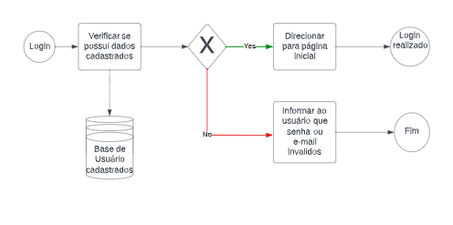
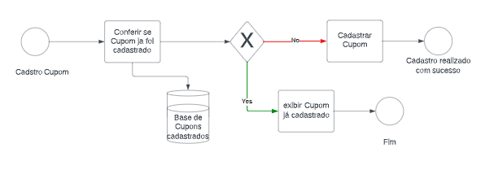
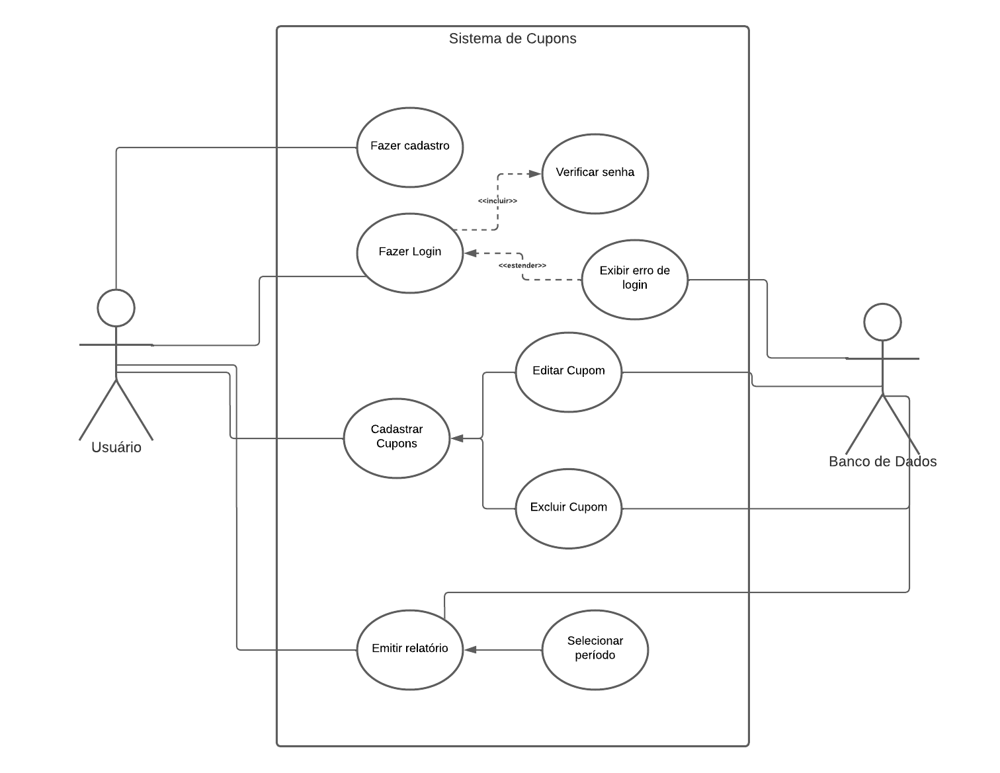
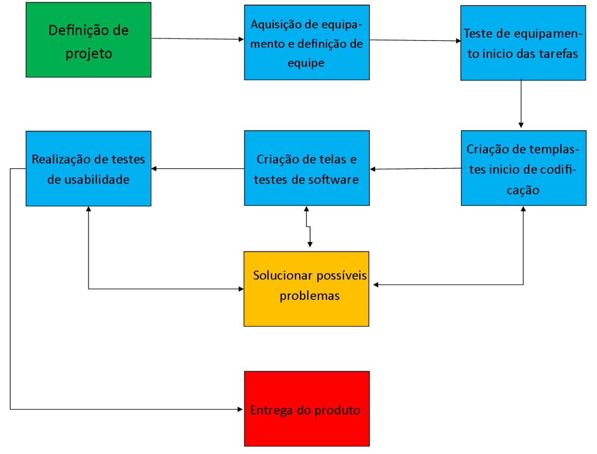
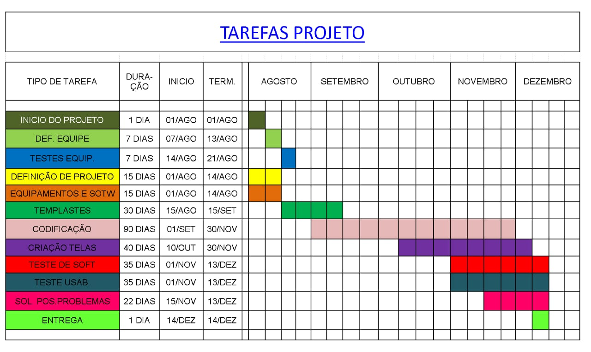
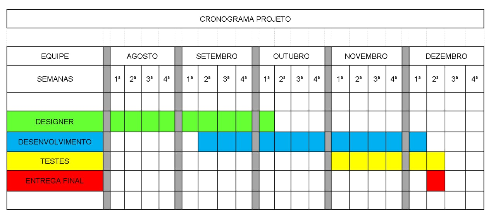
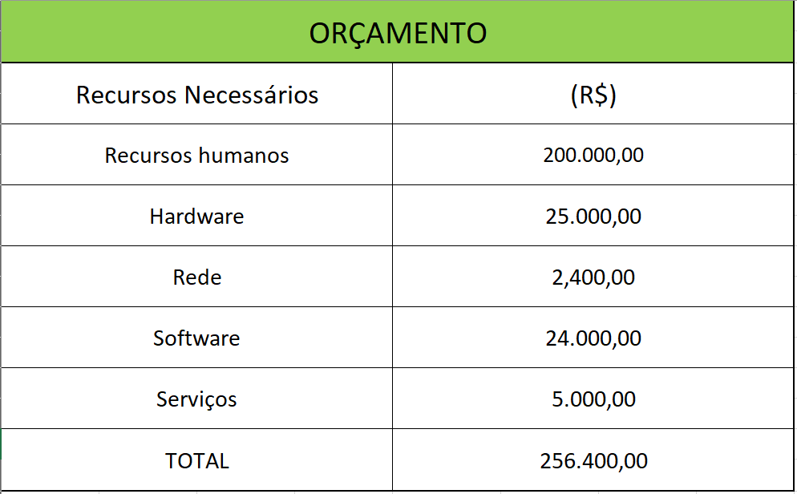

# Especificações do Projeto

Pré-requisitos: <a href="1-Documentação de Contexto.md"> Documentação de Contexto</a>

<ol>
 
 Após a definição do problema e de nosso público alvo a definição das próximas etapas passará pelo entendimento e a compreensão das pessoas as quais são o objeto desse estudo, desta forma está sendo realizando este levantamento, a fim de definir os desejos e frustrações de pessoas reais, que nos ajudará a criar um programa que irá ao seu término ajudar seus usuários, a criar de forma dinâmica e simplificada a visualização de seus cupons. As informações coletadas dentro desse processo foram compiladas na forma de personas, histórias de usuários, requisitos funcionais e não funcionais além das restrições desse projeto, de onde daremos a partida para definir possíveis situações às quais serão solucionados ao final desse projeto.
 </ol>

## Personas
<ol>
Segundo Spandin e Quincoses (2015, p.02) o estudo da persona da marca como objeto de investigação aconteceu pela motivação de entender como o perfil das marcas teve que se adaptar às novas exigências dos consumidores. Percebe-se que as marcas utilizam das personas para se tornarem humanas e tentar um contato mais direto com os públicos. Com a criação da persona da marca, ela passa a ser representada e percebida pelos públicos de forma mais espontânea e informal. (Quincoses e Spandin 2015), entender as personas de um projeto acaba por criar uma ligação da parte formal do projeto com a parte pessoal do mesmo, dando a ele uma identidade sobre a qual o trabalho indagado irá criar uma personalidade. Após a criação de nosso público alvo as personas como sendo:  
  
**- Ricardo Souza**, 53 anos, micro-empresário, divorciado, pai de três filhos, morador de Belo Horizonte- MG, realiza compras online e possui cupons de desconto e diversas empreasas de diversos ramos necessita de atualmente  de um controle melhor para seus descontos, pois muitas das vezes deixa o prazo espirar e acaba perdendo oportunidades. 
**- Beatriz Menezes**, 40 anos, professora universitária, casada, dois filhos, moradora de Nova Lima - Mg, na corretia do dia a dia, não tem tempo para cadastrar seus descontos o que muitas perca muitos dos memos necessita de uma forma de automatização desses cupons. 
**- Ângela Miranda**, 20 anos, estudante de medicina, aux. Administrativa em uma empresa de radioterapia, moradora do Rio de Janeiro- RJ, solteira, distraida com a vida proficional e universitaria  realiza divessas compras em apps de alimentação e de roupas. Necessita de uma forma mais dinamica de visualizar seus descontos, e de oportunidades futuras de desconto. 
**- Marco Nascimento**, 35 anos, casado, pai de um filho, residente em Belo Horizonte. Trabalhando o dia dentro da area de tecnologia, possuie diversos cadastros em empresas de descontos porem acessar tais empresas e cadastros ao mesmo tempo acaba se tornando inviavel pela quantidade que ele possui, assin necessita de um local (App), aonde ele possa armazenar os dados de todos os seus descontos. 
</ol>

## Histórias de Usuários
<ol>
Com base na análise das personas forma identificadas as seguintes histórias de usuários:

|EU COMO... `PERSONA`| QUERO/PRECISO ... `FUNCIONALIDADE`                |PARA ... `MOTIVO/VALOR`                  |
|--------------------|---------------------------------------------------|-----------------------------------------|
|Usuário do sistema  | [UC-001]- Registrar dados usuário                 | Acessar o sistema                       |
|Usuário do sistema  | [UC-002]- Registrar cupons de descontos           | Não esquecer de fazê-las                |
|Administrador       | [UC-003]- Alterar permissões                      | Permitir que possam administrar contas  |
|Ricardo Souza       | [UC-004]- Permitir controle de seus cupons        | Controle de seus descontos              |
|Beatriz Menezes     | [UC-005]- Cadastro automatizado de orfertas       | Acesso e inclusão dinamica de cupouns   |
|Ângela Miranda      | [UC-006]- Interação enter sistemas                | Acesso a sites de descontos e promoçoes |
|Marco Nascimento    | [UC-007]- Tabela de controle de vencimentos       | Maior controle de organização de cupons |
|                    |                                                   |                                         |

 Tabela 01: Historia de Usuario (Fonte Propria)
</ol>

## Modelagem do Processo de Negócio 
<ol>
 
### Análise da Situação Atual
<ol>
 
Atualmente com o crescente do uso da tecnologia temos uma dificuldade em ter o controle de nosso dia a dia, isso se dá pelo excesso de informações que nos é apresentado diariamente. Além disso o uso do papel acaba gerando grandes documentos, que na maioria dos casos cai em esquecimento ou até mesmo se perde no que foi utilizado ou não. Para tentar controla ou diminuir essa quantidade uma solução tecnologia acaba por se necessaria.
</ol>

### Descrição Geral da Proposta
<ol>
 
Uma possível solução para o problema relato acima é a criação de uma aplicação móvel juntamente com um site interligados por uma API, que permita o cadastro de cupons, que estariam aramazendos em bancos de dados pessoais de cada usuario, com isso a facilidade de acesso seria mais viavel.

### Processo 1 – LOGIN
<ol>
 
Representação do processo de login dos usuários.

 
 Figura-02: Processo Login (Fonte: Propria)
</ol>
 
### Processo 2 – CADASTRO CUPOM

 <ol>
 Representação do processo de cadastro de cupons.

  Figura-03: Processo Cadastro Cupons (Fonte: Propria)
 </ol>
 </ol>
</ol>

## Indicadores de Desempenho
<ol>
 
Principais indicadores de desempenho e algumas metas para o processo. Atenção: as informações necessárias para gerar os indicadores devem estar contempladas no diagrama de classe. Colocar no mínimo 5 indicadores. 

|Indicador|	Objetivos|	Descrição| Cálculo|	Fonte dados | Perspectiva|
|---------|------------------------------------------------|--------------------------------------------------------------------|--------|--------|--------|
|Cadastros de usuários|	Avaliar popularidade e aceitação do aplicativo |	 Medir a aceitação do aplicativo atráves da quantidade de cadastros de novos usuários |Percentual de novos usuários  | Tabela de cadastro de usuários  | Clientes  |
|Cadastros de Cupons|	Avaliar aceitação do aplicativo entre os prestadores de serviços |	 Medir a aceitação do aplicativo atráves da quantidade de novas empresas prestadores de serviços  | Percentual de novos prestadores de serviço  | Tabela de cadastro de prestadores de serviços  | Clientes  |
|Percentual de Reclamações|	Avaliar quantidades de avaliações negativas da aplicação|	 Calcular a quantidade de avaliações negativas para o aplicativo por usuários  | Percentual de feedbacks negativos pelo total  | Dados da play store  | Processos Internos  |
|Contagem de cadastro por data|	Avaliar quantidades de cupons cadastrados pelo usuários por data |	 Medir as datas com maiores adesões ao aplicativo | Contagem por data de cadastros de usuários e desconteo | Tabela de cadastros  | Processos Internos  |
|Contratação de Cupons|	Avaliar quantidades de cupons e tipos de serviços|	 Medir a eficiência do aplicativo | Percentual de cupons descontados | Tabela de feedback usuário  | Processos Internos  |

 Tabela 02: Indicadores de Desepeho (Fonte Propria)
 
 Obs.: todas as informações para gerar os indicadores estão no diagrama de classe apresentado posteriormente. 

</ol>
 
## Requisitos

As tabelas que se seguem apresentam os requisitos funcionais e não funcionais que detalham o escopo do projeto. Para determinar a prioridade de requisitos, aplicar uma técnica de priorização de requisitos e detalhar como a técnica foi aplicada.

### Requisitos Funcionais
 <ol>

 |ID    | Descrição do Requisito             | Prioridade |
 |------|------------------------------------|------------|
 |RF-001| Permitir que o usuário cadastre conta           | ALTA  | 
 |RF-002| Permitir que o usuário Altere dados             | MÉDIA |
 |RF-003| Permitir que o usuário realise login            | MÉDIA |
 |RF-004| Permitir que o usuário exclua conta             | BAIXA |
 |RF-005| Permitir cadastro de cupons                     | ALTA  |
 |RF-006| Permitir alteração de cupons cadastrados        | MÉDIA |
 |RF-007| Permitir exclusão de cupons                     | MÉDIA |
 |RF-008| Emitir realatrio de cupons cadastrados no mês   | MÉDIA |
 |RF-009| Permitir definir se o cupom foi usado ou não    | BAIXA |
 
 Tabela 3: Requisitos Funcionais (Fonte Propria)
 
 </ol>
 
### Requisitos não Funcionais
<ol>
 
 |ID     | Descrição do Requisito  |Prioridade |
 |-------|-------------------------|----|
 |RNF-001| O sistema deve ser responsivo para rodar em um dispositivos móvel | MÉDIA | 
 |RNF-002| O sistema deve ter uma base web |  BAIXA |
 |RNF-003| o sistema deverar contar ao menos uma API |  BAIXA |
 |RNF-004| Deve processar requisições do usuário em no máximo 3s |  BAIXA |
 |RNF-005| O sistema será construido atraves da arquiterura MVC |  BAIXA |
 |RNF-006| O Sistema deverá ser capaz de apresentar boa usabilidade |  BAIXA |
 |RNF-007| Será utilizado ferramentoas como visual code e React native para ciração do sistema|  BAIXA |
 
 Tabela 04: Requisitos Não Funcionais (Fonte Propria)

</ol>
 
## Restrições

O projeto está restrito pelos itens apresentados na tabela a seguir.
<ol>
 
|ID| Restrição                                              |
|--|--------------------------------------------------------|
|01 |	O projeto deverá ser entregue até o final do semestre |
|02	| Não funciona sem rede de internet|
|03	| Focado para Fornecedores e Empregadores de qualquer setor|
|04	| Interação com o Fornecedor|
|06	| Deverá ser gerenciável|
|07	| Deverá apresentar atualizações em tempo real |

Tabela 05: Restriçoes do Projeto (Fonte Propria)
</ol>
 
 
## Diagrama de Casos de Uso
<ol>
 
O diagrama de casos de uso é o próximo passo após a elicitação de requisitos, que utiliza um modelo gráfico e uma tabela com as descrições sucintas dos casos de uso e dos atores. Ele contempla a fronteira do sistema e o detalhamento dos requisitos funcionais com a indicação dos atores, casos de uso e seus relacionamentos. 

 
Figura-03: Diagrama de Caso de Uso (Fonte: Propria)
 
As referências abaixo irão auxiliá-lo na geração do artefato “Diagrama de Casos de Uso”.

</ol>

# Matriz de Rastreabilidade
<ol>
 
 A matriz de rastreabilidade é uma ferramenta usada para facilitar a visualização dos relacionamento entre requisitos e outros artefatos ou objetos, permitindo a     
 rastreabilidade entre os requisitos e os objetivos de negócio. 
 
 |Requisitos X UC | UC-001| UC-002| UC-003| UC-004| UC-005| UC-006| UC-007|
 |----------------|-------|-------|-------|-------|-------|-------|-------|
 |RF-001          |   X   |       |       |       |       |       |       |
 |RF-002          |   X   |       |       |       |       |       |       |
 |RF-003          |   X   |       |       |       |       |       |       |
 |RF-004          |       |   X   |       |       |       |       |       |
 |RF-005          |       |       |       |       |   X   |       |       |
 |RF-006          |       |       |       |   X   |       |       |       |
 |RF-007          |       |       |       |   X   |       |       |       |
 |RF-008          |       |       |       |       |       |       |   X   |
 |RF-009          |       |       |       |   X   |       |       |       |
 
 Tabela 06: Matriz de Rastriabilidade (Fonte Propria) 
 
 </ol>

# Gerenciamento de Projeto
<ol>

 De acordo com o PMBoK v6 as dez áreas que constituem os pilares para gerenciar projetos, e que caracterizam a multidisciplinaridade envolvida, são: Integração, Escopo, Cronograma (Tempo), Custos, Qualidade, Recursos, Comunicações, Riscos, Aquisições, Partes Interessadas. Para desenvolver projetos um profissional deve se preocupar em gerenciar todas essas dez áreas. Elas se complementam e se relacionam, de tal forma que não se deve apenas examinar uma área de forma estanque. É preciso considerar, por exemplo, que as áreas de Escopo, Cronograma e Custos estão muito relacionadas. Assim, se eu amplio o escopo de um projeto eu posso afetar seu cronograma e seus custos.
</ol>

## Gerenciamento de Tempo
<ol>
 
Com diagramas bem organizados que permitem gerenciar o tempo nos projetos, o gerente de projetos agenda e coordena tarefas dentro de um projeto para estimar o tempo necessário de conclusão.

Figura-04: Diagrama de Rede (Fonte: Propria)

O gráfico de Gantt ou diagrama de Gantt também é uma ferramenta visual utilizada para controlar e gerenciar o cronograma de atividades de um projeto. Com ele, é possível listar tudo que precisa ser feito para colocar o projeto em prática, dividir em atividades e estimar o tempo necessário para executá-las.

Figura-05: Tarefas do Projeto (Fonte: Propria)
</ol>

## Gerenciamento de Equipe
<ol>
 
O gerenciamento adequado de tarefas contribuirá para que o projeto alcance altos níveis de produtividade. Por isso, é fundamental que ocorra a gestão de tarefas e de pessoas, de modo que os times envolvidos no projeto possam ser facilmente gerenciados. 

Figura-06: Cronograma do Projeto (Fonte: Propria)
</ol>

## Gestão de Orçamento
<ol>
 
O processo de determinar o orçamento do projeto é uma tarefa que depende, além dos produtos (saídas) dos processos anteriores do gerenciamento de custos, também de produtos oferecidos por outros processos de gerenciamento, como o escopo e o tempo.

Figura-07: Orçamento do Projeto (Fonte: Propria)
</ol>
</ol>
