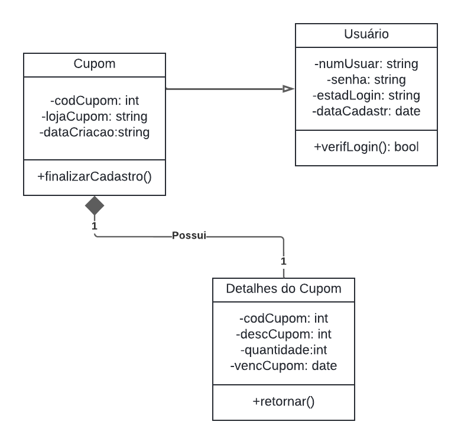
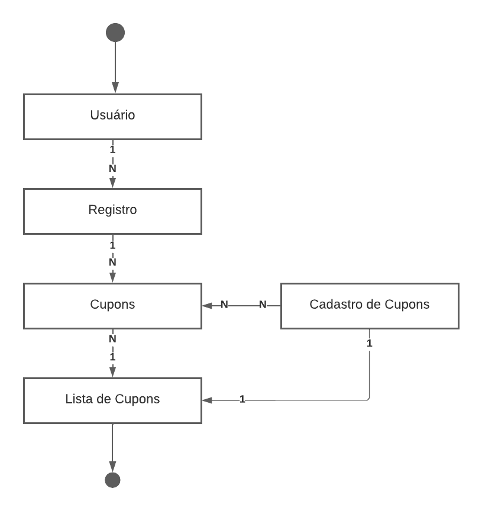
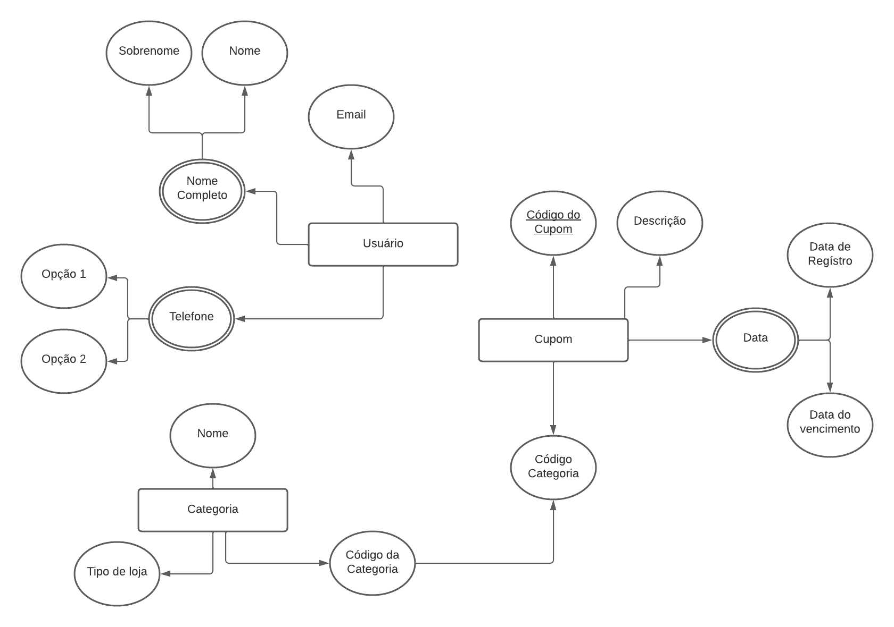

# Arquitetura da Solução

Pré-requisitos: <a href="3-Projeto de Interface.md"> Projeto de Interface</a>

<ol>
 
A IBM definiu como arquitetura de um projeto, o conjunto de decisões significativas sobre a organização de um sistema de software, a seleção de elementos estruturais e suas interfaces, juntamente com o comportamento especificado nas colaborações entre estes elementos, a composição destes elementos em subsistemas progressivamente maiores e o estilo arquitetural que guia esta organização. (The Rational Unified Process: An Introduction)(IBM, apud Nhimi, 2016) Desta forma e possível compreender que a arquitetura e um dos princípios fundamentais para a materialização de um projeto. Além disso dentro da arquitetura da solução definiremos os componentes básicos para o funcionamento deste projeto e a definição das tecnologias a serem empregadas no projeto.

 
 Figura 12: Diagrama de Componentes (Fonte Propria)
 </ol>

 ## Diagrama de Classes
<ol>
 
O diagrama de classes ilustra graficamente como será a estrutura do software, e como cada uma das classes da sua estrutura estarão interligadas. Essas classes servem de modelo para materializar os objetos que executarão na memória.

Figura 13: Diagrama de Classes (Fonte Propria)
As referências abaixo irão auxiliá-lo na geração do artefato “Diagrama de Classes”.
</ol>

## Modelo ER
<ol>
 
O Modelo ER representa através de um diagrama como as entidades (coisas, objetos) se relacionam entre si na aplicação interativa.]

 Figura 14: Modelo ER (Fonte Propria)
 
As referências abaixo irão auxiliá-lo na geração do artefato “Modelo ER”.

> - [Como fazer um diagrama entidade relacionamento | Lucidchart](https://www.lucidchart.com/pages/pt/como-fazer-um-diagrama-entidade-relacionamento)
</ol>

## Esquema Relacional

O Esquema Relacional corresponde à representação dos dados em tabelas juntamente com as restrições de integridade e chave primária.

 
 Figura 15: Esquema Relacional (Fonte Propria)
 
As referências abaixo irão auxiliá-lo na geração do artefato “Esquema Relacional”.

## Tecnologias Utilizadas

<ol>

 •	Linguagens utilizadas para o desenvolvimento desse projeto: HTML, CSS, JavaScript. 
 •	IDEs de desenvolvimento: Visual Studio Code, React Native.  
 •	Plataforma para hospedagem dos arquivos: GitHub.  
 •	Ferramentas para  a criação de imagens e logo: Canvas, Krita.  
 •	Ferramentas para criação de template: Krita.  

 
</ol>

## Hospedagem

 
 O site será hospedado na plataforma do GitHub Pages, sendo mantido atrasves da seguinte URL:

## Qualidade de Software

Conceituar qualidade de fato é uma tarefa complexa, mas ela pode ser vista como um método gerencial que através de procedimentos disseminados por toda a organização, busca garantir um produto final que satisfaça às expectativas dos stakeholders.

No contexto de desenvolvimento de software, qualidade pode ser entendida como um conjunto de características a serem satisfeitas, de modo que o produto de software atenda às necessidades de seus usuários. Entretanto, tal nível de satisfação nem sempre é alcançado de forma espontânea, devendo ser continuamente construído. Assim, a qualidade do produto depende fortemente do seu respectivo processo de desenvolvimento.

A norma internacional ISO/IEC 25010, que é uma atualização da ISO/IEC 9126, define oito características e 30 subcaracterísticas de qualidade para produtos de software.
Com base nessas características e nas respectivas sub-características, identifique as sub-características que sua equipe utilizará como base para nortear o desenvolvimento do projeto de software considerando-se alguns aspectos simples de qualidade. Justifique as subcaracterísticas escolhidas pelo time e elenque as métricas que permitirão a equipe avaliar os objetos de interesse.

> **Links Úteis**:
>
> - [ISO/IEC 25010:2011 - Systems and software engineering — Systems and software Quality Requirements and Evaluation (SQuaRE) — System and software quality models](https://www.iso.org/standard/35733.html/)
> - [Análise sobre a ISO 9126 – NBR 13596](https://www.tiespecialistas.com.br/analise-sobre-iso-9126-nbr-13596/)
> - [Qualidade de Software - Engenharia de Software 29](https://www.devmedia.com.br/qualidade-de-software-engenharia-de-software-29/18209/)
